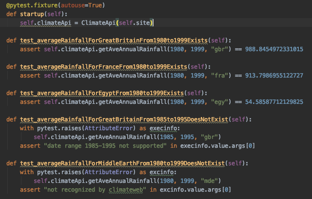

Main Servirtium site: https://servirtium.dev

# General Architecture

You're going to need a `Recorder` (to the markdown format), a `replayer` (from the markdown format), a `server` that can listen on a 
socket and work with the recorder or replayer. In the case of the recorder ("man in the middle"), the incoming requests are sent to the 'real' service too. 
In the case of the replayer, the "real service" is not involved.  

# How to start new language implementation

This is the suggested way of building Servirtium for a new language as it is methodical. That's useful because you may 
have to pause your development of this and restart later. So we're going to this in many small steps. The first isn't 
even about Servirtium at all.

Steps:

## 1. Write a simple API class with tests

Here's the the tests you want to pass (from the Python testbase - need porting to the language in question):



(Source for that: https://github.com/servirtium/demo-python-climate-tck/blob/master/src/test/TestClimateApi.py)

And the URLs you're trying to hit is `http://climatedataapi.worldbank.org/climateweb/rest/v1/country/annualavg/pr/{fromCCYY}/{toCCYY}/{countryISO}.xml`. 

Note that there is nothing of "Servirtium" in this step - this is just creation of a test harness 
in your language's preferred test runner (and following best practices including separation of 
prod code and test code, and a build script if necessary).


## 2. Implement a rudimentary "playback" for the same test cases

**This step creates a fledgeling Servirtium**

A playback Servertium (in the testbase) should be able to respond as the WorkdBank's climate web-api would for the same calls, and the new (derived or extended) tests should work offline just fine.
 
[See PlaybackClimateApiTests.java](https://github.com/servirtium/demo-java-climate-tck/blob/master/src/test/java/com/paulhammant/climatedata/PlaybackClimateApiTests.java) from the Java version and the mocks that it uses for playback [in here](https://github.com/servirtium/demo-java-climate-tck/tree/master/src/test/mocks). In the Java version PlaybackClimateApiTests is a subclass of ClimateApiTests, but you may want to achieve the same thing in a different way (say composition)  

Or [see TestPlaybackClimateApi.py](https://github.com/servirtium/demo-python-climate-tck/blob/master/src/test/TestPlaybackClimateApi.py) and the mocks that it uses for playback [in here](https://github.com/servirtium/demo-python-climate-tck/tree/master/src/mocks). The content of mocks for the Python version should be the same as the content for the Java version, even if the file names/paths are slightly different. An those mocks are checked into source-control alongside the tests, without being modified.

To be clear, the same five tests you already have the ability to pass in "direct" (no Servirtium) and "playback" modes of operation. And these two sets of five should share code as much as possible (test inheritance or compoosition - are both good).

Note too that in order to stay "in process" with this step you're going to have to leverage 
some multi-threaded or async capability to allow a test suite to issue GETs through the library 
you have HTTP chosen and simultaneously some HTTP "servierium server" to listen on a socket to satisfy that GET. Constraint is: no process spawning.


## 3. Adding "record" mode to what you have

You should have the hang of this now :)

[See RecordingClimateApiTests.java](https://github.com/servirtium/demo-java-climate-tck/blob/master/src/test/java/com/paulhammant/climatedata/RecordingClimateApiTests.java) - this (a subclass again) adds tests recording mode for the Servirtium for the same test cases.
mow

To be clear, the same tests have the ability to pass in "direct" (no Servirtium), "playback", 
and "record" modes of operation.

Success is where the recording doesn't change regardless of how many time you run the tests 
(overwriting the .md files in tests/mocks/ (or whatever you have as that directory in Git)

Note that Servirtium's record server is a deliberate man-in-the-middle - meaning that the 
climate-lib needs to invoke services on http://localhost:61417/climateweb/rest/v1/ 
instead of http://climatedataapi.worldbank.org/climateweb/rest/v1/. Specifically, the climate API test-harness 
needs to be configurable to choose the base domain name / port. A constructor arg is a good way to specify that, 
but language idioms differ.


## 4. Add a test that fails if theres a 'git diff

## 5. Add second and subsequent interaction handling

For direct tests (as well as Servirtium record and playback), add the possibility of calculating averages for more than one 
country code. Here's the Python test for that.


Yes, the 'gbr+fra' test hits the HTTP api twice. Yes, that breaks the facade pattern, but this is 
just a test harness for Servirtium.

## 5. Extract the library from the climate demo, to its own repo

This is so that others could use the library. The demo project needs to be able to acquire the 
package, of course.  Pure unit tests could be a good idea at this stage, as the climate tests 
are integration/service tests.

## 6. Other HTTP verbs other than 'GET'

POST, PUT, HEAD, DELETE, OPTIONS, TRACE and PATCH are needed too. Unlike GET, they have a request body, 
but that is pretty much the only difference. Maybe just do unit tests for these, as the extracted 
library's build shouldn't be dependent on remote services.

Some HTTP socket-listener libraries don't have a generic handler for all verbs, and instead have specific 
onGET & onPOST style methods/functionals. Meaning there's a little more copy/paste than you'd wish for.

## 7. Add a capability for a "Note".

The testing tech, can add a note for the next interaction, which will appear in the markdown. It's 
a record only thing as Playback ignores it. This serves as a rudimentary comment system for 
HUMANS (though somebody's bound to try to put YAML in there at some point):

```
## Interaction 0: POST /a/b/c

## [Note] Mary:

Mary had a little lamb,
   Its fleece was white as snow,
And every where that Mary went
   The lamb was sure to go ;

### Request headers recorded for playback:
```

## 8. Redaction, Mask, and Mutate operations

Sometimes things have to be changed in request headers and/or request body that is saved as markdown in a recording
Similarly things may have to be changed in response headers and/or response body.  

Related things that were recorded in a certain way, may have to be changed again in playback. You might have morphed 
`Date: Wed, 21 Oct 2019 07:28:00 GMT` to `Date: todays's-date-paul-was-here` for the purposes of the recording, but
in playback it needs to be changed again from `Date: todays's-date-paul-was-here` to `Date: Sun, 9 Feb 2020 11:18:03 GMT` 
so that tests still pass.

Then there's also removal of headers (and parts of a body) at both request and response level, that's needed.

For any of these it may be a good idea to get regex and non regex ways working.

## 9. Optional Markdown Settings

### Alternate code block

The three backtick way of marking code blocks in markdown, has an alternate: indented by four spaces.
That should be supported too - and should be an option in recording mode, with playback mode just adapting to what it 
encounters. A method/function on the recorder could be `indentCodeBlocks()` whatever is idiomatic for the style of API 
you are building.

### Emphasis for HTTP verb/method

GET and POST may be in the markdown as emphasised like *GET* or *POST* (asterisk or underscore before & after the word in the 
markdown). This should be optional too via a recorder method like `emphasizeHttpVerbs()` (or similar). The Playback mode should 
just adapt to what it encounters.

## 10 Fail a playback step if the request is not as previously recorded

That is any of URL, method, request header, or request body. If they are different in playback than 
they were in the prior recordings then servertium's playback needs to deliberately fail. If the recorder has a 
mechanism to alpha-sort or redact headers/bodies, then the playback side also needed that. Pretty-print too. 
Otherwise and "is different" determination will do false positives.

Close of socket is an admirable way to communicate failure. 

Serverium should make the **reason** for the failure available to the test runner. The only
reasonable way to do that is inform the test-runner technology of the reason when/if the test runner asks.  So
the the same way there is a `setContext(string)` method/function from the point of view of the test runner,
there should also be a `getLastError()` mechanism to pull the failure details back to the test runner and 
inform the developer. That could be via an "after" test mechanism (after each, not after all/suite).

## 11. Publish to package/module-land for your language family

That's "Maven central", pub.dev, cpan, RubyGems, NuGet-land etc.

## 12. Proxy Server mode of operation

This one varies per language and the HTTP request initiation available. Client calls to an arbitrary server, can be run through 
a proxy server on the way there. Some commercial Service Virtualization techs like HoverFly work this way by design. For Servirtium 
it is an option.  If mounted as a Proxy Server technologies that would call over the wire may not be specifically configured 
for it.

# Notes on prior implementations

If you're making a new impl, you don't actually have to understand the architecture of previous implementations. Indeed, your impl may be better for not being educated on prior implementations.

* [Java using Netty, Undertow and OKHttp libraries](java-version-architecture.md)

