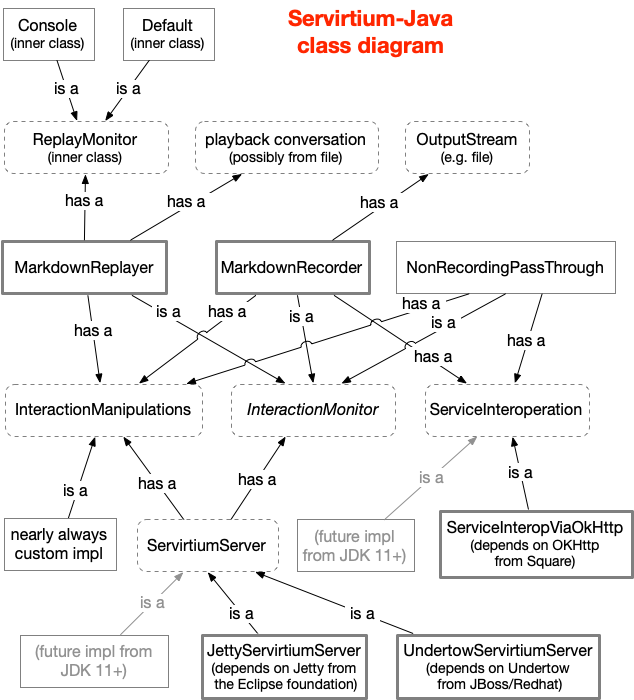

# General Architecture

You're going to need a `Recorder` (to the markdown format), a `replayer` (from the markdown format), a `server` that can listen on a 
socket and work with the recorder or replayer. In the case of the replayer, the incoming requests are sent to the 'real' service too. 
In the case of the replayer, the "real service" is not involved.  

# "Baby Steps" for a new language implementation

This is the suggested way of building Servirtium for a new language as it is methodical. That's useful because you may 
have to pause your development of this and restart later.

Steps:

## 1. Start with an implementation of "direct" with tests
 
In the Java demo that utilizes the World-Bank's Climate API [take a look at ClimateApiTests.java](https://github.com/servirtium/demo-java-climate-data-tck/blob/master/src/test/java/com/paulhammant/climatedata/ClimateApiTests.java). Obviously not JUnit for your language, but PyTest, RSpec, Jasmine, NUnit (etc) instead. 

Here's the sum total of the "direct" tests from the Python testbase:

(Source for that: https://github.com/servirtium/demo-python-climate-data-tck/blob/master/src/test/TestClimateApi.py)

And the URLs you're trying to hit is `http://climatedataapi.worldbank.org/climateweb/rest/v1/country/annualavg/pr/{fromCCYY}/{toCCYY}/{countryISO}.xml`. Yes, the 'gbr+fra' test hits the HTTP api twice (yes that breaks the facade pattern, but this is just a test harness for Servirtium).

## 2. Implement the "playback" for the same test cases
 
[See PlaybackClimateApiTests.java](https://github.com/servirtium/demo-java-climate-data-tck/blob/master/src/test/java/com/paulhammant/climatedata/PlaybackClimateApiTests.java) and the mocks that it uses for playback [in here](https://github.com/servirtium/demo-java-climate-data-tck/tree/master/src/test/mocks). In the Java version PlaybackClimateApiTests is a subclass of ClimateApiTests, but you may want to achieve the same thing in a different way.  This creates your fledgeling Servirtium.

To be clear, the same tests have the ability to pass in "direct" (no Servirtium) and "playback" modes of operation

## 3. Adding "record" mode

You should have the hang of this now :)

[See RecordingClimateApiTests.java](https://github.com/servirtium/demo-java-climate-data-tck/blob/master/src/test/java/com/paulhammant/climatedata/RecordingClimateApiTests.java) - this (a subclass again) adds tests recording mode for the Servirtium for the same test cases.
mow

To be clear, the same tests have the ability to pass in "direct" (no Servirtium), "playback", and "record" modes of operation

Success is where the recording doesn't change regardless of how many time you run the tests (overwriting the .md files in tests/mocks/ (or whatever you have as that directory in Git)

## 4. Extract the library from the climate demo, to its own repo

This is so that others could use the library. The demo project needs to be able to acquire the package, of course.  Pure unit tests
could be a good idea at this stage, as the climate tests are integration/service tests.

## 5 Other HTTP verbs other than 'GET'

POST, PUT are needed too - unlike GET they have a request body. Maybe just do unit tests for this, as the library's build shouldn't be
overly dependant on remote services.

# Prior implementations

# Java using Netty, Undertow and OKHttp libraries.

Here's a class diagram for Java implementation.

You'd only copy that if it makes sense for your language. That's because doing things in an idiomatically 
correct way for your language could mean something very different. The Python version of Servertium is much more 
pythonic than the class-centric Java version.

So in the first Java implementation, there's a 
`Recorder` or `playback` that works in conjunction with a `Servirtium Server` which listens on a socket an is
a "man in the middle". That last has a dependency on Jetty or Undertow (two alternate implementations) 
Alternates in Java could be Jetty or Tomcat. All of those 
are open source web servers. There's one built into to later versions of Java, so that could be another
alternate one day. Ruby and Python had built-in web servers far sooner than Java did, so that'll be less dramatic.

Similarly, outgoing HTP requests in the Java solution is via the open source component OkHttp. Later versions 
of java build that in so at some point there'll be a implementation that does that.

Really though, Jetty and OkHttp are decent choices for this tech as it is **test time only**. Nobody's production
system will depend on this. We need functional correctness, error resilience but not million-requests a second 
scale. 

